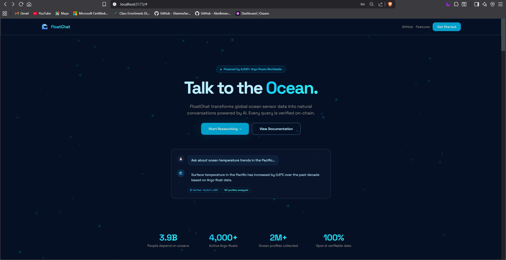
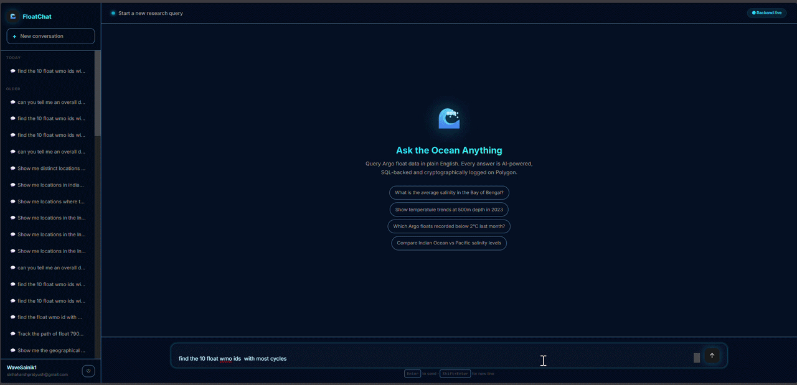

# 🌊 FloatChat-AI — Democratizing Ocean Science

> *"3.9 billion people depend on oceans. The data exists. But it's locked in formats that need a PhD to open. FloatChat lets any researcher, student, or policymaker just… ask."*

A project by **Team Wavesena** · [Team Repository](https://github.com/Lakshya1509/FloatChat-AI)

---

## What Is FloatChat?

FloatChat is an **AI-powered ocean data query platform** built on top of the global [Argo float network](https://argo.ucsd.edu/) — a fleet of ~4,000 autonomous sensors measuring ocean temperature and salinity across every major ocean basin.

Instead of requiring a PhD and Python skills to query Argo data, FloatChat lets anyone ask in plain English:

> *"What is the average salinity in the Bay of Bengal at 500m depth?"*

and get back a real, SQL-backed, AI-summarised answer — with every query **cryptographically logged on the Polygon blockchain** for scientific reproducibility.

---

## 🎬 Demo

### Landing Page



### Homepage Walkthrough


### Chat Interface in Action



---

## 🏗️ System Architecture

```
┌─────────────────────────────────────────────────────────────────┐
│                        FLOATCHAT STACK                          │
├──────────────┬──────────────────────────────┬───────────────────┤
│   FRONTEND   │         BACKEND              │    BLOCKCHAIN     │
│              │                              │                   │
│  React +     │  FastAPI                     │  Solidity         │
│  Vite        │    └─ LangGraph RAG          │  FloatChatAudit   │
│  Supabase    │         ├─ FAISS retrieve    │  on Polygon Amoy  │
│  Auth        │         ├─ Gemini LLM (SQL)  │                   │
│  Leaflet     │         ├─ Validate SQL      │  web3.py hook     │
│  Maps        │         ├─ Execute SQL       │  after every      │
│              │         └─ Summarise         │  successful query │
│              │  Supabase PostgreSQL         │                   │
│              │  (100K+ Argo profiles)       │                   │
└──────────────┴──────────────────────────────┴───────────────────┘
```

### Agentic RAG Pipeline Flow (LangGraph)

```
User Question
    │
    ▼
[1] RETRIEVE  ── FAISS semantic search → schema + few-shot SQL examples
    │
    ▼
[2] ROUTE     ── Classify intent: data query vs general Q&A (bidirectional failsafes)
    │
    ▼
[3] REWRITE   ── Resolve co-references against chat history for multi-turn context
    │
    ▼
[4] GENERATE  ── Google Gemini → structured SQL via Pydantic with_structured_output
    │
    ▼
[5] VALIDATE  ── AST-based SQL validation (sqlglot) + schema enforcement + QC rules
    │             If invalid → loop back to GENERATE with error injection (max 3 retries)
    ▼
[6] EXECUTE   ── psycopg2 → Supabase PostgreSQL (read-only, 15K row cap)
    │
    ▼
[7] SUMMARISE ── Gemini LLM → Pandas data science digest + NL summary
    │
    ▼
[8] AUDIT     ── SHA256(question + SQL + result) → Polygon Amoy blockchain TX
    │
    ▼
Response: { summary, sql_query, data, audit_hash, tx_hash, polygonscan_url }
```

---

## ✨ Key Features

| Feature | Description |
|---|---|
| **Agentic RAG Pipeline** | 8-node LangGraph state machine with conditional routing, self-correction loops, and bidirectional failsafe edges |
| **NL2SQL Engine** | Natural language → validated PostgreSQL via Gemini structured outputs with AST validation |
| **Semantic Few-Shot Injection** | FAISS retrieves similar SQL examples to guide LLM generation |
| **Multi-Turn Conversations** | Context-aware question rewriter resolves co-references against chat history |
| **Interactive Map Visualizations** | 3 modes: clustered density maps, polyline trajectory tracking, temperature/salinity color gradient heatmaps |
| **Blockchain Audit Trail** | Every query SHA-256 hashed and logged on Polygon Amoy — immutable, citable, verifiable |
| **Streaming Responses (SSE)** | Real-time token streaming via Server-Sent Events to React frontend |
| **Geographic Downsampling** | `TABLESAMPLE BERNOULLI` for statistically representative spatial sampling of 500K+ row datasets |
| **Data Science Summarization** | Pandas `describe()` compresses datasets before LLM summarization — 99% token reduction |
| **Supabase Auth** | Email/password + Google OAuth, Row-Level Security on conversations and messages |
| **CSV Export** | Client-side full dataset download from any query result |

---

## 🗄️ Database Schema

### `argo_profiles` — One row per Argo float profile (measurement cycle)

| Column | Type | Notes |
|---|---|---|
| `id` | SERIAL PK | Internal ID |
| `wmo_id` | INTEGER | World Meteorological Organization float ID |
| `cycle_number` | INTEGER | Float's dive cycle number |
| `profile_datetime` | TIMESTAMP | When the profile was recorded |
| `latitude` | DOUBLE | Geographic position |
| `longitude` | DOUBLE | Geographic position |
| `data_mode` | CHAR(1) | `R` = real-time, `D` = delayed (quality-controlled) |

### `argo_measurements` — Vertical measurements at multiple depths

| Column | Type | Notes |
|---|---|---|
| `profile_id` | FK → argo_profiles | Links to parent profile |
| `pressure` | DOUBLE | Depth in decibars (higher = deeper) |
| `temp_adjusted` | DOUBLE | Temperature °C — scientifically corrected |
| `psal_adjusted` | DOUBLE | Salinity PSU — scientifically corrected |
| `temp_qc` | CHAR(1) | Quality flag. `'1'` = good data |
| `psal_qc` | CHAR(1) | Quality flag. `'1'` = good data |

> ⚠️ **Schema Rule**: The RAG validator enforces `TEMP_ADJUSTED` and `PSAL_ADJUSTED`. Raw `TEMP` and `PSAL` are banned — they're uncorrected sensor data and scientifically invalid.

---

## ⛓️ Blockchain Audit Trail

Every successful FloatChat query is **permanently recorded on the Polygon Amoy blockchain**:

- A researcher can **cite a TX hash in a paper** — the query is permanently on-chain
- Proves FloatChat **didn't hallucinate** — the result hash is immutable
- **Real problem in ocean science**: reproducibility is everything

**Smart Contract:** `FloatChatAudit.sol` deployed at `0xa30Af03B660e97AEaE67f73e31f5eBEdB224Df88` on Polygon Amoy Testnet

**What gets hashed:** `SHA256( user_question + generated_sql + JSON(query_result) )` — independently reproducible by any researcher.

---

## 🚀 Running the Stack

### Prerequisites

- Python 3.10+
- Node.js 22.12+
- Git

### 1. Clone & Install

```bash
git clone https://github.com/HarxhPratyuxh/FloatChat-AI.git
cd FloatChat-AI

# Python backend
python -m venv venv
.\venv\Scripts\activate          # Windows
# source venv/bin/activate       # Mac/Linux
pip install -r requirements.txt

# React frontend
cd frontend
npm install
cd ..
```

### 2. Configure `.env`

```env
# ── Core ──────────────────────────────────────────────────────────
DATABASE_URL=postgresql://...supabase...
GOOGLE_API_KEY=your-gemini-api-key

# ── Supabase Auth (frontend) ───────────────────────────────────────
VITE_SUPABASE_URL=https://your-project.supabase.co
VITE_SUPABASE_ANON_KEY=eyJ...

# ── Blockchain (Polygon Amoy Testnet) ─────────────────────────────
POLYGON_AMOY_RPC_URL=https://rpc-amoy.polygon.technology/
FLOATCHAT_CONTRACT_ADDRESS=0xa30Af03B660e97AEaE67f73e31f5eBEdB224Df88
BLOCKCHAIN_WALLET_ADDRESS=0x...your wallet...
BLOCKCHAIN_PRIVATE_KEY=...your private key (no 0x prefix)...
```

> 🔒 `.env` is in `.gitignore` — **never commit your private key**.

### 3. Build the FAISS Index (one-time)

```bash
python rag/build_index.py
```

### 4. Start Everything

```bash
# Terminal 1 — FastAPI backend
python -m uvicorn api.main:app --reload --port 8000

# Terminal 2 — React frontend
cd frontend
npm run dev
```

- Backend: http://localhost:8000
- Frontend: http://localhost:5173
- API Docs: http://localhost:8000/docs

---

## 🔌 API Reference

### `POST /query` — Main RAG endpoint (SSE streaming)

```bash
curl -X POST http://localhost:8000/query \
  -H "Content-Type: application/json" \
  -d '{"question": "What is the average temperature at 200m depth in the Indian Ocean?"}'
```

### `POST /rerun-sql` — Re-execute stored SQL (map reload)

```bash
curl -X POST http://localhost:8000/rerun-sql \
  -H "Content-Type: application/json" \
  -d '{"sql": "SELECT latitude, longitude FROM argo_profiles TABLESAMPLE BERNOULLI(5)"}'
```

### `GET /health` — Health check

```bash
curl http://localhost:8000/health
```

---

## 📁 Tech Stack

| Layer | Technologies |
|---|---|
| **AI / LLM** | LangGraph, LangChain, Google Gemini, FAISS, SentenceTransformers, Pydantic |
| **Backend** | Python, FastAPI, psycopg2, Pandas, APScheduler, Web3.py |
| **Frontend** | React, Vite, React-Leaflet, Recharts, Supabase SDK |
| **Database** | Supabase PostgreSQL (100K+ Argo profiles) |
| **Blockchain** | Solidity, Polygon Amoy Testnet, Web3.py |
| **Auth** | Supabase Auth (Email + Google OAuth, Row-Level Security) |

---

## 🔧 Troubleshooting

| Error | Fix |
|---|---|
| `FAISS index not found` | Run `python rag/build_index.py` |
| `Connection refused` on frontend | Start backend: `uvicorn api.main:app --reload --port 8000` |
| Gemini token limit | Large result set — backend auto-truncates to 15K rows |
| Blockchain `out of gas` | Get MATIC from [alchemy.com/faucets/polygon-amoy](https://www.alchemy.com/faucets/polygon-amoy) |
| Supabase SSL error | Use `sslmode='require'` in psycopg2 connection string |

---

## 📄 License

See `LICENSE` in the repository root.

---

*Built with ❤️ for ocean science by Team Wavesena*
